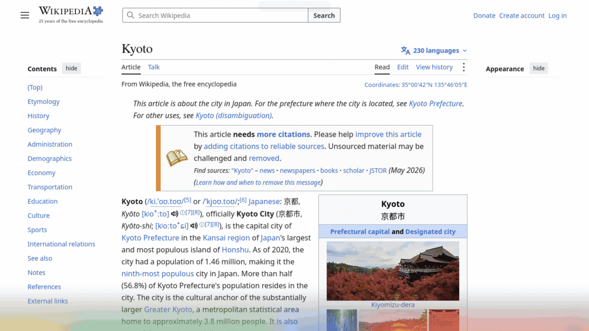

> ‼️ AI SLOP WARNING

# search

Circle to Search for the Linux desktop. Press a shortcut, circle or tap something on the screen, and search for it on Google or Google Lens. For short selections, the app also shows cards with extra information.



The page in the preview is the Wikipedia article [Kyoto](https://en.wikipedia.org/wiki/Kyoto) (CC BY-SA 4.0).

It is made for KDE Plasma 6 on Wayland. GNOME on Wayland is supported through the screenshot portal, but it is not tested on GNOME yet.

## How it works

1. The app takes a screenshot and shows it as a full-screen overlay.
2. You circle an area or tap a word.
3. OCR reads the text in that area.
4. A search bar shows the text. You can edit it, search it, copy it, or send the area to Google Lens.
5. If the selection is short, cards appear next to the search bar.

## Cards

| You select | Cards |
|---|---|
| A word | Definition, pronunciation, translation |
| A place | Map, weather for 7 days, facts, places nearby |
| A country | Facts, currency rate, public holidays, population and GDP |
| A person, company or project | Summary, facts, GitHub repository, PyPI or npm package |
| An address | Map |
| An amount of money | The amount in your currency |
| A measurement | The value in your unit system |
| A date | Weekday, month calendar, "add to calendar" link |
| A time with a time zone | Your local time |
| A colour (`#4285F4`, `rgb()`, `hsl()`) | Formats, contrast, shades, matching colours |
| A link, email or phone number | Open, write or call |
| A Nova Poshta or Ukrposhta tracking number | Tracking link |
| A sentence in another language | Translation |
| A short calculation | The result |
| A QR code or barcode | Wi-Fi network (connect with NetworkManager), 2FA code, payment, contact, link, book or product |
| An event, like "Sync with Anna Thursday 15:00 Zoom" | Google Calendar link and an .ics file |
| An IBAN | Check digits, country and bank |
| A table | Copy for a spreadsheet, as Markdown or as CSV |
| Code | The code with its indentation |
| An error message or code | HTTP status, errno, signal, exit code, SQLSTATE, HRESULT or exception, explained |
| A Unix time, .NET ticks or ISO 8601 date | Local time, UTC and relative time |
| A JWT | Header, claims and expiry. The token is decoded on your computer and not sent anywhere. |
| A UUID | Version, and the time for v1, v6 and v7 |
| A cron expression | Plain English and the next five runs |
| Base64, hex, URL encoding or JSON | Decoded or formatted |
| An area with no text | Its colours |

Copying from a card keeps the overlay open. Shades, matching colours and palette swatches show their value when you hover them. Long lists, code and tables scroll.

Names in other scripts (for example "Львів" or "東京") are found on the Wikipedia of their own language and shown with the English article.

## Requirements

- KDE Plasma 6 or GNOME, on Wayland
- Python 3.11 or newer, or Python 3.10 with the `tomli` package
- PyQt6
- Tesseract OCR with the English language pack, and packs for other languages you want to read
- Hunspell English dictionary (used to tell words from names)
- `wl-clipboard` (for copying on Wayland)
- `zbar` (`zbarimg`) for QR codes and barcodes. `zxing-cpp` with Pillow also works.
- On KDE: `gcc` and GLib development files (to build the screenshot helper)
- On GNOME: `xdg-desktop-portal` and `xdg-desktop-portal-gnome`. These are installed with GNOME.

On Fedora:

```
sudo dnf install python3-pyqt6 tesseract tesseract-langpack-eng hunspell-en-US wl-clipboard zbar gcc glib2-devel
```

Other OCR languages use the package name `tesseract-langpack-<code>`, for example `tesseract-langpack-ukr` or `tesseract-langpack-deu`.

On Ubuntu and Debian:

```
sudo apt install python3-pyqt6 tesseract-ocr tesseract-ocr-eng hunspell-en-us wl-clipboard zbar-tools
```

Other OCR languages use the package name `tesseract-ocr-<code>`, for example `tesseract-ocr-ukr`.

## Install on KDE Plasma

1. Clone the repository:

   ```
   git clone https://github.com/styanr/search.git
   cd search
   ```

2. Build the screenshot helper:

   ```
   gcc -O2 -o kwin-grab kwin-grab.c $(pkg-config --cflags --libs gio-unix-2.0)
   ```

3. Allow the helper to take screenshots. KWin only gives screenshots to programs that are listed in a desktop file. Create `~/.local/share/applications/circle-search-grab.desktop` with this content, and change the path to where you cloned the repository:

   ```
   [Desktop Entry]
   Type=Application
   Name=Circle to Search screenshot helper
   Exec=/home/you/search/kwin-grab
   NoDisplay=true
   X-KDE-DBUS-Restricted-Interfaces=org.kde.KWin.ScreenShot2
   ```

   Then run `kbuildsycoca6`.

   Without this step the app still works, but it uses Spectacle for screenshots, which is about 0.5 seconds slower.

4. Add a keyboard shortcut. Open System Settings → Keyboard → Shortcuts → Add New → Command or Script. Use this command, with your path:

   ```
   python3 /home/you/search/circle_search.py
   ```

   Then choose a key, for example Meta+S.

## Install on GNOME

1. Clone the repository:

   ```
   git clone https://github.com/styanr/search.git
   cd search
   ```

2. Install the desktop file. The screenshot portal uses it to know the app. Change the path in `Exec` to where you cloned the repository, then copy the file:

   ```
   cp io.github.styanr.search.desktop ~/.local/share/applications/
   ```

3. Add a keyboard shortcut. Open Settings → Keyboard → View and Customize Shortcuts → Custom Shortcuts → Add Shortcut. Use this command, with your path:

   ```
   python3 /home/you/search/circle_search.py
   ```

   Then choose a key, for example Super+S.

4. The first time you use the shortcut, GNOME asks "Allow Circle to Search to Take Screenshots?". Choose Allow. GNOME saves the answer, Allow or Deny, and does not ask again.

   To remove the saved answer, so that GNOME asks again:

   ```
   busctl --user call org.freedesktop.impl.portal.PermissionStore /org/freedesktop/impl/portal/PermissionStore org.freedesktop.impl.portal.PermissionStore DeletePermission sss screenshot screenshot io.github.styanr.search
   ```

### How screenshots work on GNOME

GNOME does not let other programs use its own screenshot interface. The app uses the screenshot portal (`org.freedesktop.portal.Screenshot`) instead. The portal saves the permission for an app ID. To have its own ID, the app moves itself into a systemd scope named `app-io.github.styanr.search-<pid>.scope`, and on xdg-desktop-portal 1.20 or newer it also registers the ID with the portal. Without this, the permission is saved for all apps that have no ID.

The portal saves the screenshot as a file. The app reads the file and deletes it.

## Use

| Action | Result |
|---|---|
| Circle or scribble | Select an area |
| Tap | Select the word under the cursor |
| Enter | Run the suggested search (text or image) |
| Ctrl+Enter | Search the selected area with Google Lens |
| Ctrl+C | Copy the text |
| Ctrl+P | Pin the selected area to the screen |
| Type | Search for what you type |
| Down | Recent selections and searches |
| Right-click | Clear the selection |
| Esc | Close |

The pin button on a card keeps that card on the screen after the overlay closes. Drag a pin to move it, scroll on an area pin to zoom, and double-click or press Esc to close it. On KDE the pins stay above other windows.

Run with `--instant` to search as soon as you finish circling.

## Settings

Click the gear in the top-right corner of the overlay to change settings, or edit them by hand. Settings are read from `~/.config/circle-search/config.toml` (or `$XDG_CONFIG_HOME/circle-search/config.toml`) each time the app starts. The file is optional, and any setting left out keeps its default:

```toml
contact = "you@example.com"

[locale]
units = "imperial"

[ocr]
languages = ["eng", "jpn"]
```

| Setting | Default | Meaning |
|---|---|---|
| `contact` | none | Your email or website. Sent to Wikimedia and OpenStreetMap only, because their rules ask for a contact. |
| `cards` | `true` | Set to `false` to turn off cards. |
| `history` | `true` | Set to `false` to stop saving recent selections and searches to `~/.local/share/circle-search/history.jsonl`. |
| `gpu` | `"auto"` | Set to `"lite"` to stop the glow and shimmer from animating. This is automatic with software OpenGL (llvmpipe). |
| `router` | `"local"` | Which router decides the kind of selection. Only `"local"` is built in. |
| `debug` | `false` | Set to `true` to save each screenshot and OCR result to `~/.cache/circle-search/debug/`. |
| `locale.language` | from your regional settings | Language for translations, as a two-letter code (`"uk"`, `"de"`). |
| `locale.currency` | from your regional settings | Currency to convert to (`"UAH"`, `"EUR"`). |
| `locale.units` | from your regional settings | `"metric"` or `"imperial"`. |
| `ocr.languages` | English and your region's language | Languages to read (`["eng", "jpn"]`). Each one needs its Tesseract language pack. Each language makes OCR slower. |

If the file has a mistake, the app says so on standard error and uses the default for that setting. Older versions read `CIRCLE_SEARCH_*` environment variables; those are no longer read.

The app reads your language, currency and units from the KDE regional settings (`LC_ADDRESS`, `LC_MONETARY`, `LC_MEASUREMENT`). The card text is in English.

## Services and privacy

OCR runs on your computer. Cards and searches use these online services. The selected text, or the values found in it, is sent to them.

| Service | Used for | Terms |
|---|---|---|
| Google Search | Text search | |
| Google Lens | Image search, only when you choose it. The image is sent from your browser. | |
| Google Translate (unofficial endpoint) | Translations, language detection | May stop working without notice |
| Wikipedia, Wiktionary, Wikivoyage | Summaries, definitions, travel text | CC BY-SA |
| Wikidata and QLever | Facts | CC0 |
| OpenStreetMap (Nominatim and map tiles) | Addresses, maps | ODbL. Light use only. |
| Open-Meteo | Weather, air quality | CC BY 4.0, non-commercial use |
| National Bank of Ukraine | Rates when your currency is UAH | |
| Frankfurter (European Central Bank rates) | Rates for about 30 currencies | |
| currency-api | Rates for other currencies | |
| World Bank | Population and GDP | CC BY 4.0 |
| Nager.Date | Public holidays | |
| GitHub, deps.dev | Repository data | GitHub allows 60 requests per hour without a token |
| PyPI, npm | Package data | |

## Files

| File | Contents |
|---|---|
| `circle_search.py` | Starts the app |
| `circlesearch/core/` | The app logic. It does not use Qt. |
| `core/routing.py` | Decides what kind of selection it is (recognizers and routers) |
| `core/pipeline.py` | Turns a selection into cards (resolvers and enrichers) |
| `core/cards.py` | The base card types |
| `core/ocr.py`, `core/textindex.py` | OCR engines and the words found on the screen |
| `core/barcode.py` | QR code and barcode engines |
| `core/layout.py` | Tables and code rebuilt from the positions of the words |
| `core/history.py` | Recent selections and searches |
| `core/locale.py` | Your language, currency and units, and how to format them |
| `core/settings.py` | Reads the settings file |
| `core/actions.py` | Search, Lens, open and copy |
| `circlesearch/plugins/` | One folder for each feature: weather, money, places and so on |
| `circlesearch/ui/` | The Qt app: overlay, search bar, card board, card widgets, pins, screenshots |
| `circlesearch/cli.py` | Looks up text from the terminal: `python3 -m circlesearch.cli Kyoto` |
| `kwin-grab.c` | Takes a screenshot through KWin's D-Bus interface |
| `io.github.styanr.search.desktop` | Desktop file. Needed on GNOME for the screenshot permission |

## Plugins

Each folder in `circlesearch/plugins/` is a plugin. The app loads all of them at start. A plugin can add any of these:

| Part | Decorator | What it does |
|---|---|---|
| Recognizer | `@recognizer(kind, order=…)` in `core.routing` | Finds a value in the text, for example a colour or a date. Pass `raw=True` to get the text before it is cleaned. |
| Layout recognizer | `@layout(kind, order=…)` in `core.layout` | Finds a value in the positions of the words, for example a table |
| Resolver | `@resolver(kind, …)` in `core.pipeline` | Makes the main card for a kind of selection |
| Enricher | `@enricher(name, needs={…})` in `core.pipeline` | Makes extra cards from facts that other cards found, for example weather from `lat` and `lon` |
| Card type | a `@dataclass` that extends `Card`, `TextCard` or `HeroCard` | The data that a card shows |
| View | `@view(CardClass)` in `ui.cards`, in the plugin's `view.py` | How the card looks. Without a view, the card uses the generic text view. |

`__init__.py` must not import Qt. Put Qt code in `view.py`. A view's `prepare(card)` runs off the main thread, so decode images there. A view can also handle `wheel`, `press`, `drag` and `release`, and animate in `step(dt)`.

To match the other cards, build views from the parts in `ui/cards.py` (`header`, `chip_row`, `paragraph`, `big_value`, `rows`, `button_group`, `copyable`, `footer`) and the sizes and colours in `ui/tokens.py`. A card's `accent` picks its colour family: `blue` for knowledge and places, `green` for money, `red` for dates and time, `amber` for software, and `neutral` for tools and data.

A small plugin, `circlesearch/plugins/ip/__init__.py`:

```python
import ipaddress
from dataclasses import dataclass

from circlesearch.core.cards import TextCard
from circlesearch.core.pipeline import resolver
from circlesearch.core.routing import recognizer


@dataclass(kw_only=True)
class IpCard(TextCard):
    kind = "ip"


@recognizer("ip", order=5)
def parse_ip(text):
    try:
        return ipaddress.ip_address(text.strip())
    except ValueError:
        return None


@resolver("ip")
def ip_card(route):
    ip = route.value
    return IpCard(title=str(ip), chips=[f"IPv{ip.version}", "private" if ip.is_private else "public"])
```

Screenshot backends (`ui/capture.py`), OCR engines (`core/ocr.py`) and routers (`core/routing.py`) use registries in the same way. If two plugins register the same name, the plugin that loads last wins. Plugins load in alphabetical order. If a plugin fails to load, the app skips it and prints the error.

## Limitations

- Fast screenshots work only on KDE Plasma (KWin). On GNOME and other desktops the app uses the screenshot portal.
- Pins stay above other windows on KDE only. On GNOME they are normal windows.
- OCR can misread small text or text in fonts with unusual shapes. Check the text in the search bar if a card does not appear.
- A name that is also a common word (for example "React") may show the dictionary meaning instead of the article.
- The Google Translate and Google Lens endpoints are not official APIs and can change.

## License

MIT. See `LICENSE`.

The fonts in `fonts/` (Google Sans Flex and Google Sans) use the SIL Open Font License 1.1. See the license files in that folder.
